<!--
  CYBERPUNK CONSOLE PROFILE
  Slices are generated by scripts/ and refreshed by .github/workflows/update-profile.yml.
  Edit data/projects.json or scripts/lib/*.mjs — not assets/.
  Keep images on one line with no whitespace between them, or the console splits.
-->

<a href="https://github.com/qormsxo/pick-flow"></a><a href="https://github.com/qormsxo/ai-provider-gateway"></a><a href="https://feed-briefly.vercel.app"></a><a href="https://github.com/qormsxo/workflow-approval-engine"> submitted > in_review > approved/rejected and per-state statistics."></a><a href="https://github.com/qormsxo/traffic-jam-simulator"></a><a href="https://github.com/qormsxo/kiosk-simulation"></a>

